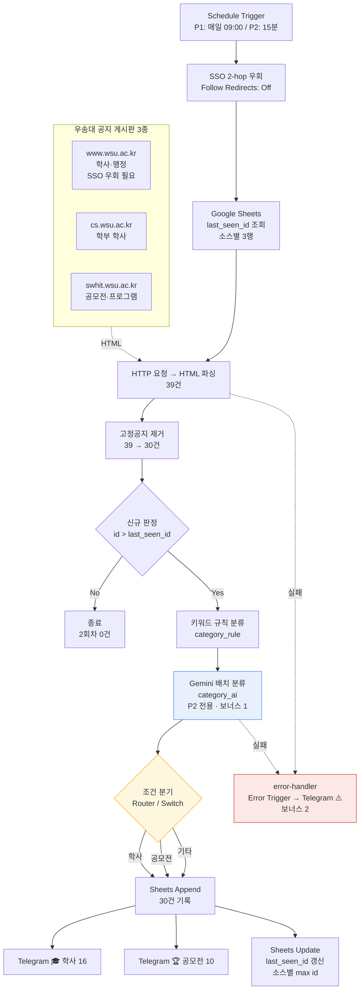
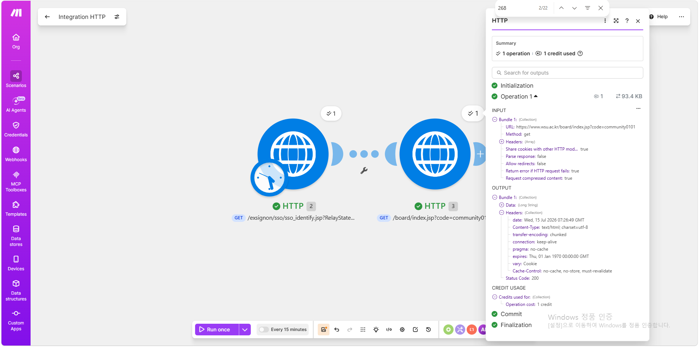
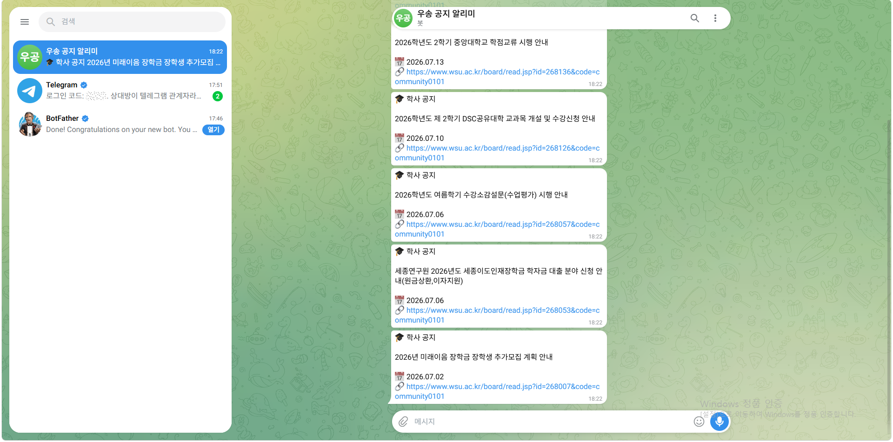
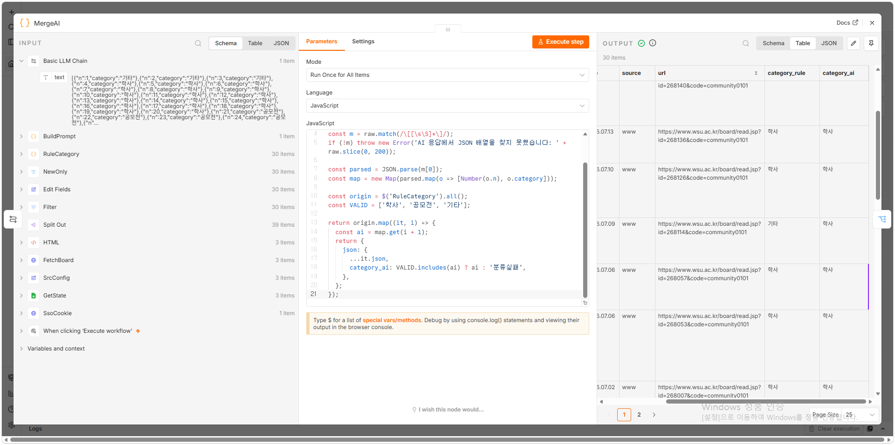
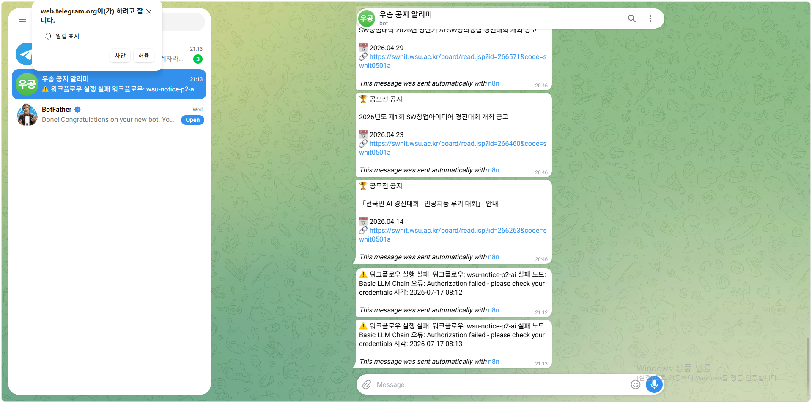

# wsu-notice-bot

우송대학교 공지사항 3개 게시판을 자동으로 감시하여, 신규 공지를 분류한 뒤 텔레그램으로 알리고 Google Sheets에 기록하는 노코드 자동화 프로젝트입니다.

**노코드 자동화 기초: 워크플로우 설계** 과제 제출물이며, 동일 워크플로우를 **Make**와 **n8n** 두 도구로 구현하여 비교한 프로젝트 1과, n8n에 **생성형 AI 분류**를 결합한 프로젝트 2로 구성됩니다.

---

## 1. 과제 개요

| 프로젝트 | 내용 | 도구 |
|---|---|---|
| **프로젝트 1** — 자동화 도구 비교 구현 | 동일한 워크플로우를 Make와 n8n으로 각각 구현하고, 구현 중 실측한 차이를 근거로 9개 항목을 비교 분석하였습니다. | Make (클라우드) / n8n (로컬 자가호스팅) |
| **프로젝트 2** — 자유 주제 자동화 설계 및 구현 | "3개 게시판을 매일 직접 확인하는 반복 업무"를 15분 주기 자동 감시로 전환하고, Gemini를 분류 Action으로 추가하였습니다. | n8n |

두 프로젝트는 **같은 대상(우송대 공지 게시판)** 을 다루되 목적이 다릅니다. 프로젝트 1은 도구 비교를 위한 **통제 실험**(양쪽 09:00 1회 고정)이고, 프로젝트 2는 실제로 쓰기 위한 **실사용 파이프라인**(15분 주기 + AI)입니다.

---

## 2. 요구사항 충족 대응표

과제 요구사항이 어디에서 확인되는지 정리한 표입니다.

### 공통 요구사항

| 요구사항 | 프로젝트 1 (Make) | 프로젝트 1 (n8n) | 프로젝트 2 (n8n) | 상세 | 증빙 |
|---|---|---|---|---|---|
| 실제 동작하는 워크플로우 | ✅ 09:00 스케줄 활성화 | ✅ 09:00 스케줄 활성화 | ✅ 15분 스케줄 활성화 | — | [📷 make](screenshots/project1/make/03-schedule-daily-0900.png) · [n8n](screenshots/project1/n8n/03-schedule-daily-0900.png) · [p2](screenshots/project2/01-schedule-15min.png) |
| Trigger 1개 이상 | Schedule (매일 09:00) | Schedule (매일 09:00) | Schedule (15분) | [P1 §2](docs/project1-comparison.md) / [P2 §3.2](docs/project2-design.md) | [📷 09:00](screenshots/project1/make/03-schedule-daily-0900.png) · [15분](screenshots/project2/01-schedule-15min.png) |
| Action 2개 이상 | Sheets Add a Row, Telegram, Sheets Update a Cell | Sheets Append, Telegram, Sheets Update Row | + Gemini 호출 | 〃 | [📷 시트](screenshots/project1/make/07-sheets-notices-30.png) · [텔레그램](screenshots/project1/make/05-telegram-academic.png) |
| 조건 분기 1개 이상 | Router (4경로) | Switch (3경로) + Filter | Switch (3경로) + Filter 2개 | 〃 | [📷 make](screenshots/project1/make/06-canvas-full-30.png) · [n8n](screenshots/project1/n8n/04-canvas-full-30.png) · [p2](screenshots/project2/06-canvas-full-30.png) |
| **각 분기 경로 1회 이상 실행** | 학사 16 / 공모전 10 / 기타 4 | 학사 16 / 공모전 10 / 기타 4 | 학사 16 / 공모전 10 / 기타 4 | [P1 §4.4](docs/project1-comparison.md) | [📷 학사](screenshots/project1/make/05-telegram-academic.png) · [공모전](screenshots/project1/make/09-telegram-contest.png) · [기타·시트](screenshots/project1/make/07-sheets-notices-30.png) |

분기 3경로를 모두 실제로 발동시키기 위해, `_state` 시트의 `last_seen_id` 초기값을 **각 소스의 현재 최소 ID − 1** 로 설정하여 첫 실행에서 30건 전부를 통과시켰습니다. 2회차부터는 자동으로 0건이 됩니다.

### 프로젝트별 요구사항

| 요구사항 | 충족 | 위치 | 증빙 |
|---|---|---|---|
| 서로 다른 2개 이상의 도구 | Make / n8n (Zapier 제외 사유 명시) | [P1 §1](docs/project1-comparison.md) | [📷 make](screenshots/project1/make/06-canvas-full-30.png) · [n8n](screenshots/project1/n8n/04-canvas-full-30.png) |
| 동일한 워크플로우 구조 | 파싱 경로가 다름에도 출력 30건 완전 일치 | [P1 §4.4](docs/project1-comparison.md) | [📷 make 시트](screenshots/project1/make/07-sheets-notices-30.png) · [p2 시트](screenshots/project2/08-sheets-notices-p2.png) |
| 최소 5개 이상의 비교 항목 | **9개** | [P1 §5](docs/project1-comparison.md) | — |
| 각 도구의 장단점 | 항목별 정리 | [P1 §6](docs/project1-comparison.md) | — |
| 어떤 상황에 적합한지 | 용도별 권장 | [P1 §7](docs/project1-comparison.md) | — |
| 2회차 중복 미발송 (멱등성) | 양쪽 0건 | [P1 §4.4](docs/project1-comparison.md) | [📷 캔버스](screenshots/project1/make/10-canvas-second-run-zero.png) · [시트 불변](screenshots/project1/make/11-sheets-notices-unchanged.png) |
| 반복 업무 1개 정의 | 3개 게시판 순회 확인 (연 18~30시간) | [P2 §1](docs/project2-design.md) | — |
| 도구 1개 선정 및 이유 | n8n — 프로젝트 1의 크레딧 실측이 근거 | [P2 §2](docs/project2-design.md) | [📷 크레딧](screenshots/project1/make/12-credit-usage.png) |
| Trigger 발생 시 자동 실행 | Schedule Trigger 15분, 실행 이력으로 확인 | [P2 §3](docs/project2-design.md) | [📷 스케줄](screenshots/project2/01-schedule-15min.png) · [실행이력](screenshots/project2/09-executions-error-handler.png) |
| 보너스 1 — AI 연동 Action | Gemini 분류 노드 추가 | [P2 §4](docs/project2-design.md) | [📷 규칙vsAI](screenshots/project2/07-mergeai-rule-vs-ai.png) |
| 보너스 2 — 실패 알림 및 재시도 | Error Workflow + Retry On Fail | [P2 §5](docs/project2-design.md) | [📷 재시도](screenshots/project2/04-llm-retry-settings.png) · [실패알림](screenshots/project2/10-telegram-error-alert.png) |
| 민감정보 마스킹 | JSON 4개 마스킹 완료 | [§9](#9-워크플로우-json-사용-안내) | — |

---

## 3. 리포지토리 구조

```
wsu-notice-bot/
├── README.md
├── docs/
│   ├── project1-comparison.md      # 프로젝트 1 — 도구 비교 분석 보고서
│   └── project2-design.md          # 프로젝트 2 — 워크플로우 설계 문서
├── workflows/                      # 마스킹 처리된 워크플로우 JSON
│   ├── wsu-notice-bot-make.json    # P1 — Make 시나리오
│   ├── wsu-notice-bot-n8n.json     # P1 — n8n 워크플로우
│   ├── wsu-notice-p2-ai.json       # P2 — n8n + AI 워크플로우
│   └── error-handler.json          # P2 — 실패 알림 워크플로우
└── screenshots/
    ├── project1/make/              # Make 구성·실행 화면
    ├── project1/n8n/               # n8n 구성·실행 화면
    └── project2/                   # P2 구성·실행·AI·오류 알림 화면
```

---

## 4. 아키텍처



**세 게시판은 동일한 JSP 기반 CMS를 사용**하며 `read.jsp?id=NNNNNN` 형태의 URL 패턴을 공유합니다. RSS/Atom 피드가 제공되지 않아, **스케줄 트리거 + HTTP 요청 + HTML 파싱** 방식을 채택하였습니다. 게시글 `id`를 고유 키로 사용합니다.

**신규 판정은 `last_seen_id` 방식**입니다. 세 사이트가 ID 공간을 공유하지만 게시판별 진행 속도가 다르므로, 상태를 **소스별로 분리 관리**합니다. 이 설계 판단이 프로젝트 1 비교 항목 8(상태 갱신 설계)의 배경이 되었습니다.

**AI 분류 노드는 프로젝트 2에만 존재**하며, 기록·비교용입니다. 텔레그램 발송 경로를 결정하는 것은 여전히 키워드 규칙(`category_rule`)입니다. AI 응답이 실패한 날에도 서비스가 규칙 기반으로 계속되도록 한 보수적 설계이며, 절충의 근거와 대가는 [P2 §8 한계 6](docs/project2-design.md)에 기록하였습니다.

---

## 5. 프로젝트 1 — 자동화 도구 비교 구현

> 📄 **[전체 보고서: docs/project1-comparison.md](docs/project1-comparison.md)**

**Make**(클라우드 SaaS)와 **n8n**(로컬 자가호스팅)으로 동일 워크플로우를 구현하고, 양쪽 모두 **매일 09:00 1회**로 실행 주기를 고정하여 통제 실험을 구성하였습니다.

Zapier는 당초 3종 비교 대상으로 검토하였으나, **무료 플랜이 2-step Zap만 허용**하여 과제 요구사항(Trigger 1 + Action 2 + 분기 1)을 구조적으로 충족할 수 없었습니다. 비교 대상에서 제외하고 제약 분석 사례로만 기록하였습니다.

### 실행 결과 — 양쪽 완전 일치

| | Make | n8n |
|---|---|---|
| 수집 (고정공지 제거 후) | 30건 | 30건 |
| 학사 / 공모전 / 기타 | 16 / 10 / 4 | 16 / 10 / 4 |
| 텔레그램 발송 | 26건 | 26건 |
| 2회차 | 0건 | 0건 |

파싱 수단이 다름에도(Make = 정규식 Text Parser, n8n = CSS 셀렉터 HTML Extract) **출력이 정확히 일치**하므로, "동일한 워크플로우 구조로 구현한다"는 요구를 데이터로 증명할 수 있습니다. 동시에 두 도구가 서로의 결과를 검증하는 대조군 역할을 하였습니다.

세 게시판 중 www는 직접 접근 시 SSO 로그인 페이지로 리다이렉트되어 실패하며(비교 항목 1), 이를 2-hop 우회로 해결하였습니다.



### 비교 항목 9개 (요구: 5개 이상)

| # | 항목 | 우위 |
|---|---|---|
| 1 | SSO 리다이렉트 처리 | 동일 (양쪽 실패) |
| 2 | 쿠키 공유 | Make |
| 3 | 분기 모델 (다중 매칭 / 단일 매칭) | n8n |
| 4 | 서드파티 인증 설정 | Make |
| 5 | 과금 모델 | n8n |
| 6 | 데이터 흐름 모델 | 용도별 |
| 7 | 표현식 언어 | 용도별 |
| 8 | 상태 갱신 설계 | Make |
| 9 | 타임존 | Make |

각 항목의 실측 근거와 판정 이유는 보고서 §5에 있습니다. **집계 자체에는 의미를 두지 않았습니다.** 항목마다 성격과 무게가 다르기 때문입니다.

두 도구는 우열 관계가 아니라 트레이드오프 관계이며, 구현을 통해 확인한 패턴은 **"Make의 제약은 설계를 강제하고, n8n의 자유는 책임을 요구한다"** 였습니다. 자세한 논의는 보고서 §9에 있습니다.

---

## 6. 프로젝트 2 — 자유 주제 자동화 설계 및 구현

> 📄 **[전체 설계 문서: docs/project2-design.md](docs/project2-design.md)**

**반복 업무:** 재학생이 학사 일정과 교외 활동 정보를 얻으려면 서로 다른 3개 게시판을 각각 방문해야 합니다. 1회 3~5분, 연간 18~30시간입니다.

이 업무의 핵심 문제는 시간이 아니라 **누락의 비대칭성**입니다. 매일 확인해도 대부분의 날은 볼 것이 없지만, 거른 날에 선착순 모집 공고가 올라오면 기회를 잃습니다. 보상이 희박하고 실패 비용만 큰, 자동화에 적합한 전형적 업무입니다. 자동화 후 사용자의 작업은 **능동적 확인(pull)에서 수동적 수신(push)으로 전환**됩니다.

분류 결과에 따라 학사(🎓)와 공모전(🏆) 알림이 텔레그램으로 발송됩니다.



**도구 선정: n8n.** 프로젝트 1에서 실측한 크레딧 규칙(모듈 실행 1회 = 1 크레딧, 번들 수만큼 후속 모듈에 전파)에 따르면, 15분 주기는 **11 크레딧 × 96회 = 1,056/일** 로 Make 무료 플랜(1,000/월)을 하루 만에 초과합니다. AI 노드를 추가하면 더 늘어납니다. 과제 제약이 "무료 플랜으로 완수 가능한 조합을 우선 고려한다"이므로 n8n이 유일한 선택지였습니다.

---

## 7. 보너스 과제

### 보너스 1 — AI 연동 Action

Gemini를 분류 Action으로 추가하여, 키워드 규칙과 **동일 표본에 대해 병렬 산출**하고 대조하였습니다.

| 분류 방식 | 정확도 |
|---|---|
| 키워드 규칙 (4차 개선 후) | 29 / 30 |
| **Gemini 배치 분류** | **30 / 30** (2회 재현) |



불일치 1건은 `2026학년도 제2학기 충남대학교 수학 안내(학부 및 대학원)` 입니다. 규칙은 `수학`을 교과목명으로 보아 `기타`로, AI는 문맥상 학사 안내로 보아 `학사`로 분류하였습니다. 한국어 2글자 한자어의 중의성으로 인한 **규칙 기반의 구조적 한계**이며, 4차에 걸친 규칙 개선과 3차의 "수정 불가" 판정을 거친 뒤 AI로 넘어갔습니다. 이 순서 덕분에 AI의 문맥 이해가 정확히 무엇을 해결했는지 특정할 수 있었습니다.

Gemini 무료 티어가 **5 RPM**이라 아이템당 호출이 불가능하여, 30건을 번호 매긴 목록 1건으로 병합하는 **배치 프롬프트(호출 1회)** 로 전환하였습니다. 상세는 [P2 §4](docs/project2-design.md)에 있습니다.

### 보너스 2 — 실패 알림 및 재시도 전략

| 전략 | 구현 |
|---|---|
| 실패 알림 | 별도 워크플로우 `error-handler` — Error Trigger → Telegram ⚠️ (워크플로우명·실패 노드·오류 메시지·시각 전송) |
| 재시도 | `FetchBoard` Retry On Fail 3회 / 2초, `Basic LLM Chain` Retry On Fail 3회 / 30초 |

의도적으로 실패를 발생시켜 검증하였습니다. 이 과정에서 **Error Workflow는 자동 실행 실패에서만 발동하며 수동 실행 실패에는 알림이 오지 않는다**는 점(n8n의 의도된 동작), **Error Workflow를 지정하려면 대상 워크플로우가 Publish 상태여야 한다**는 점을 확인하였습니다. 상세는 [P2 §5](docs/project2-design.md)에 있습니다.



---

## 8. 수행 과정

| 단계 | 내용 |
|---|---|
| **환경 구축** | Make 계정 생성 / n8n 로컬 실행(`npx n8n`, 포트 5678 고정) / Google Sheets·Telegram·Gemini 자격증명 연결 |
| **대상 분석** | 3개 게시판의 CMS 구조·URL 패턴 분석, RSS 부재 확인, `id`를 고유 키로 확정, SSO 우회 경로 확인 |
| **구현** | Make 시나리오 → n8n 워크플로우 순으로 동일 구조 구현. 각 도구의 관용적 방식(정규식 / CSS 셀렉터)을 채택하되 입출력은 동일하게 설계 |
| **검증** | 첫 실행에서 30건 전부 통과시켜 분기 3경로 발동 확인 → 2회차 0건 확인 → 양쪽 출력 대조 |
| **확장 (P2)** | 15분 주기 전환 → 키워드 규칙 4차 개선 → AI 분류 병렬 산출 → Error Workflow·Retry 추가 |
| **문서화** | 비교 보고서·설계 문서 작성, 워크플로우 JSON 마스킹, 스크린샷 정리 |

포트를 5678로 고정한 것은 **Google OAuth 리디렉션 URI 등록값과 일치해야 하기 때문**입니다. 임의 포트로 실행하면 인증이 실패합니다.

---

## 9. 워크플로우 JSON 사용 안내

`workflows/` 의 JSON 4개는 **민감정보가 마스킹된 상태**입니다. 그대로 import 하면 동작하지 않으며, 아래 토큰을 실제 값으로 교체해야 합니다.

| 마스킹 토큰 | 교체할 값 | 해당 파일 |
|---|---|---|
| `***TELEGRAM_CHAT_ID***` | 텔레그램 chat_id | 4개 전부 |
| `***SPREADSHEET_ID***` | Google Sheets 문서 ID | make, n8n, p2-ai |
| `***INSTANCE_ID***` | n8n 인스턴스 식별자 (import 시 자동 부여되므로 교체 불필요) | n8n, p2-ai, error-handler |
| `jsh***@gmail.com` | 계정 이메일 (표시용 label이므로 교체 불필요) | make |

**봇 토큰 · Google OAuth Client ID/Secret · Gemini API 키는 애초에 JSON에 포함되지 않습니다.** n8n의 `credentials` 블록은 자격증명의 ID와 이름만 담으며, import 후 각자의 자격증명을 다시 연결해야 합니다. Make의 커넥션도 동일합니다.

### import 절차 (n8n)

```
1. n8n 실행 → Workflows → Import from File
2. 위 표에 따라 ***SPREADSHEET_ID***, ***TELEGRAM_CHAT_ID*** 교체
3. Google Sheets / Telegram / Gemini 자격증명 재연결
4. 워크플로우 설정에서 타임존을 Asia/Seoul 로 지정  ← 기본값이 America/New_York 입니다
5. Google Sheets에 필요한 탭 생성 (구조는 각 문서의 부록 참조)
6. _state 탭의 last_seen_id 초기값 설정
```

**4번은 반드시 확인해야 합니다.** n8n의 기본 타임존은 America/New_York이며, 지정하지 않으면 스케줄이 13시간 어긋난 채 조용히 동작합니다. 프로젝트 1 비교 항목 9가 이 문제입니다.

---

## 10. 설계 한계

우연히 동작하는 것을 의도된 설계로 포장하지 않기 위해, 알려진 한계 중 중요한 3가지를 기록합니다. 전체 목록은 [P1 §8](docs/project1-comparison.md) (5개), [P2 §8](docs/project2-design.md) (8개)에 있습니다.

| 한계 | 영향 |
|---|---|
| **Make의 고정공지 배제는 정규식의 우연한 부작용입니다.** 고정공지가 `<td class="date"><strong>` 구조라, `>` 뒤 숫자를 요구하는 정규식에 걸리지 않을 뿐입니다. | 학교가 CSS를 변경하면 파싱이 깨집니다. n8n은 Filter로 `<strong` 포함 여부를 명시 검사하므로 이 문제가 없습니다. |
| **n8n 자가호스팅은 호스트 PC 가동이 전제입니다.** | 노트북이 꺼지면 스케줄이 실행되지 않습니다. Make는 클라우드라 무관하나, 프로젝트 2는 과금 때문에 Make를 선택할 수 없었습니다. |
| **AI 분류의 30/30은 정확도 보장이 아닙니다.** 표본 30건, 단일 시점에서 2회 재현된 관측입니다. | AI는 비결정적이므로 라우팅을 맡기지 않았습니다. AI 결과는 기록·비교용입니다. |

---

## 11. 실행 환경

| 항목 | 값 |
|---|---|
| OS | Windows 11 |
| Node.js | v24.18.0 |
| n8n | `npx n8n` → `http://localhost:5678` (포트 고정 — OAuth 리디렉션 URI) |
| n8n 워크플로우 | `wsu-notice-bot` (P1) / `wsu-notice-p2-ai` (P2) / `error-handler` |
| Make | 클라우드 (무료 플랜) |
| Google Sheets | 클라우드 — `wsu-notice-bot` 문서 1개, 탭 6개 |
| 타임존 | 워크플로우별 `Asia/Seoul` 명시 지정 |
